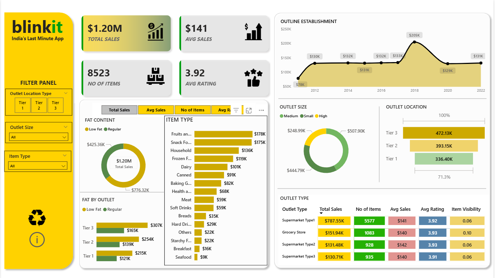

# Blinkit_Sales_Dashboard_using_PowerBi
# 🛒 Blinkit Sales Analysis Dashboard – Power BI

## 📌 Project Overview
An interactive and visually appealing **Power BI dashboard** built to analyze Blinkit sales performance, outlet distribution, and product trends.  
This project converts raw business data into actionable insights using data modeling, DAX, and advanced visualizations.

---

## 📊 Dashboard Preview

## 🚀 Key Metrics

- 💰 **Total Sales:** $1.20M  
- 📦 **Total Items Sold:** 8,523  
- ⭐ **Average Rating:** 3.92  
- 🏪 Highest Sales from Tier 3 Outlets  
- 🛒 Supermarket Type 1 generated maximum revenue  

---

## 📈 Dashboard Features

- ✅ Interactive Filter Panel (Outlet Location Type, Outlet Size, Item Type)
- ✅ KPI Cards for Total Sales, Avg Sales, No. of Items, Avg Rating
- ✅ Year-wise Sales Trend Analysis
- ✅ Outlet Size Distribution Analysis
- ✅ Tier-wise Location Performance Comparison
- ✅ Category-wise Item Type Revenue Breakdown
- ✅ Fat Content Analysis by Outlet
- ✅ Outlet Type Summary Table with Visibility & Ratings

---

## 🛠️ Tools & Technologies Used

- **Power BI**
- **Power Query**
- **DAX (Data Analysis Expressions)**
- **Data Modeling**
- **Data Visualization Best Practices**

---

## 📊 Business Insights Derived

- Tier 3 outlets contribute the highest overall revenue.
- Medium-sized outlets dominate sales distribution.
- Fruits, Snacks, and Household categories lead in item sales.
- Sales peaked significantly in 2018.
- Supermarket Type 1 has the highest total sales contribution.

---

## 💡 Skills Demonstrated

- Data Cleaning & Transformation  
- Data Modeling & Relationship Building  
- Advanced DAX Calculations  
- KPI Development  
- Interactive Dashboard Design  
- Business Intelligence & Insight Generation  

---

## 📌 Conclusion

This project demonstrates strong capabilities in **Business Intelligence, Data Visualization, and Analytical Thinking**, delivering meaningful insights from structured datasets using Power BI.
